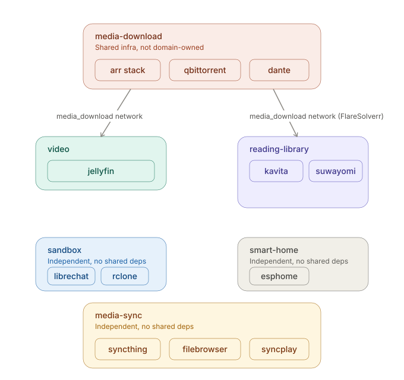

# homelab

A two-node homelab setup for various shenanigans.

Services are grouped into clusters by domain rather than one folder per
container — see [Repo structure](#repo-structure) below. `media-download` is
shared infrastructure consumed by both `video` and `reading-library`; it
isn't owned by either.

## Services by cluster

### media-download

| Service      | kostyan-server                                       | nat-server                                       |
|--------------|-------------------------------------------------------|---------------------------------------------------|
| Radarr       | http://kostyan-server.salmon-halfmoon.ts.net:7878     | http://nat-server.salmon-halfmoon.ts.net:7878     |
| Sonarr       | http://kostyan-server.salmon-halfmoon.ts.net:8989     | http://nat-server.salmon-halfmoon.ts.net:8989     |
| Prowlarr     | http://kostyan-server.salmon-halfmoon.ts.net:9696     | http://nat-server.salmon-halfmoon.ts.net:9696     |
| QBittorrent  | http://kostyan-server.salmon-halfmoon.ts.net:8080     | http://nat-server.salmon-halfmoon.ts.net:8080     |

### media-sync

| Service         | kostyan-server                                          | nat-server                                         |
| ---------------- | -------------------------------------------------------- | ---------------------------------------------------- |
| Syncthing        | http://kostyan-server.salmon-halfmoon.ts.net:8384       | http://nat-server.salmon-halfmoon.ts.net:8384      |
| Filebrowser      | http://kostyan-server.salmon-halfmoon.ts.net:8082      | http://nat-server.salmon-halfmoon.ts.net:8082      |

### video

| Service  | kostyan-server                                     | nat-server                                     |
|----------|------------------------------------------------------|---------------------------------------------------|
| Jellyfin | http://kostyan-server.salmon-halfmoon.ts.net:8096   | http://nat-server.salmon-halfmoon.ts.net:8096   |

### reading-library

| Service   | kostyan-server                                     |
|-----------|-------------------------------------------------------|
| Kavita    | http://kostyan-server.salmon-halfmoon.ts.net:5000   |
| Suwayomi  | http://kostyan-server.salmon-halfmoon.ts.net:4567   |

### sandbox

| Service   | nat-server                                     |
|-----------|-----------------------------------------------|
| LibreChat | http://nat-server.salmon-halfmoon.ts.net:3080 |

### smart-home

| Service | kostyan-server                                     |
|---------|-------------------------------------------------------|
| ESPHome | http://kostyan-server.salmon-halfmoon.ts.net:6052   |

### audiobooks

| Service        | nat-server                                     |
|----------------|------------------------------------------------|
| Audiobookshelf | http://nat-server.salmon-halfmoon.ts.net:13378 |

nat-server's `media-download` has no local Dante instance — its qBittorrent
proxies peer traffic through kostyan-server's Dante over Tailscale instead.
See `services/media-download/README.md` for details.

## Repo structure



```
services/
  media-download/   # arr, dante, qbittorrent — shared infra, network: media_download
  video/             # jellyfin
  reading-library/   # kavita, suwayomi — depends on media-download's network
  sandbox/           # librechat, rclone
  smart-home/        # esphome
  audiobooks/        # audiobookshelf
```

`media-download` is the one cluster with a dependent: `video`,
`reading-library` and `audiobooks` attach to its `media_download` network (Jellyfin
doesn't currently need to, but Suwayomi does — for FlareSolverr). Bring
`media-download` up before either of those clusters. `sandbox` and
`smart-home` have no shared dependencies and can start in any order.

Every cluster has its own README with an access table, stack table, paths
table, first-run commands, post-startup steps, and known gotchas. This
top-level file is just the map.

## Conventions

- **GitOps workflow**: edit on laptop → commit to this repo → pull and run
  on the target node.
- **Secrets**: `.env.example` is committed, `.env` is gitignored. Runtime
  secrets that aren't compose env vars live under `/opt/` and are never
  committed.
- **Node-specific config**: base compose + override pattern
  (`docker-compose.<node>.yml`) for hardware differences, e.g. Jellyfin's
  NVENC override on nat-server.
